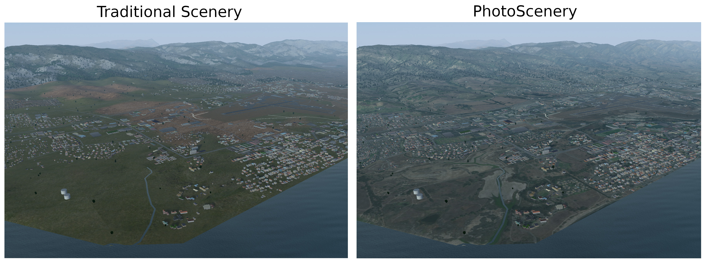

# FlightGear PhotoScenery

This project brings support for photoscenery to FlightGear, the free and open-source flight simulator.
The photoscenery is an overlay, which overrides the traditional scenery textures when there is a satellite orthophoto available for the current tile.
It is fully compatible with Atmospheric Light Scattering (as well as the default pipeline), and works with your existing scenery.

Normally, FlightGear uses generic terrain textures. Photoscenery allows you to recognize the terrain, improving your experience when flying with visual flight rules (VFR).



## Getting it

This project has now been merged into upstream FlightGear, so you no longer need to apply patches or build from source! Visit the [FlightGear nightly builds website](http://download.flightgear.org/builds/nightly/) to obtain the latest build for your platform of choice. Source code is also available.

## Using It

You can easily make photoscenery using the [creator.py](creator.py) script. Provide either `--lon` and `--lat`, or `--index` (bucket index). Also provide `--scenery_folder` to specify where to save it. (Otherwise it will save to the current directory.)

For example, to make photoscenery for the tile containing the Eiffel Tower, you would first find its coordinates. (Latitude 48.858, Longitude 2.295) Then, you run the script, providing the coordinates.

```
python creator.py --lat 48.858 --lon 2.295
```

_Note: If your system uses Python 2, you'll need to run `python3` instead of `python`._

When you run FlightGear, you'll need to go to the "Add-ons" tab of the launcher, and add the folder where you saved it as an "Additional scenery folder".

Once you're loaded in (after pressing "Fly" in the launcher), you can toggle the photoscenery on and off in the Rendering settings menu in FlightGear.

## Manual Instructions

You'll need to have an `Orthophotos/` subdirectory in one of your scenery folders, alongside `Terrain/`, `Buildings/`, etc. You could put it in existing custom scenery packages, or keep your orthophotos in a separate package (for example to use them with TerraSync).

The `Orthophotos/` subdirectory is further split by geographic location to mirror other scenery subdirectories. The orthophotos themselves are normal PNG files, named after their tile number. You can determine the tile number you need, as well as the base path in which to save it, by using the [creator.py](creator.py) script, passing `--show_info` as an argument to show tile information rather than automatically download the photo.

**_Attention: You no longer need to flip the orthophoto vertically._**
